# Mermaid Diagrams For The Project

This file contains a complete Mermaid pack for the current codebase (`FastAPI + NLP + Vision + Playwright + Reporting`).

## 1) System Context

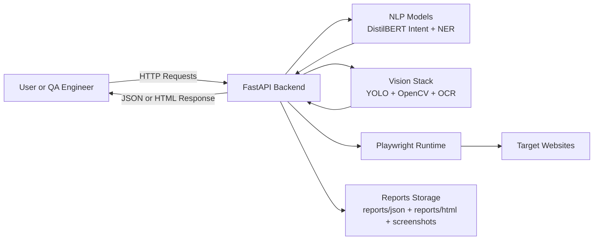

## 2) Backend Component Diagram

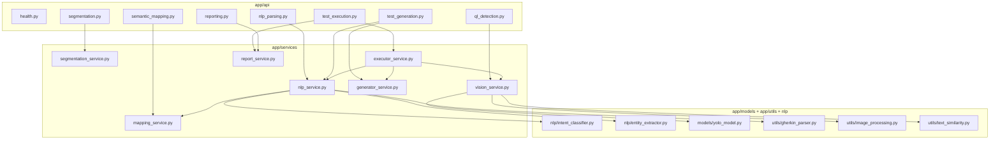

## 3) API Endpoints Map

```mermaid
flowchart LR
    C[Client]
    C --> E1[GET /health]
    C --> E2[POST /api/ia/parse-gherkin]
    C --> E3[POST /api/ia/semantic-mapping]
    C --> E4[POST /api/ia/detect-ui]
    C --> E5[POST /api/ia/segment]
    C --> E6[POST /api/ia/generate-test]
    C --> E7[POST /api/ia/execute-test]
    C --> E8[GET /api/ia/reports]
    C --> E9[GET /api/ia/reports/{execution_id}]
    C --> E10[GET /api/ia/reports/{execution_id}/summary]
```

## 4) NLP Parsing Pipeline

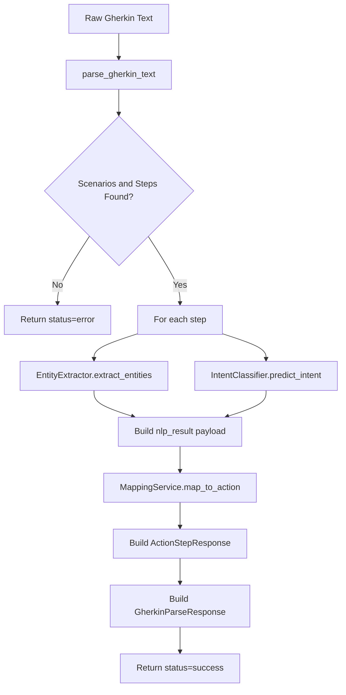

## 5) Semantic Mapping Logic

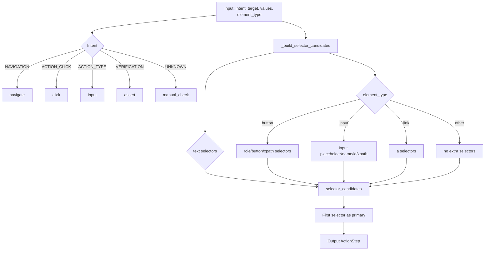

## 6) Vision Detection and OCR Pipeline

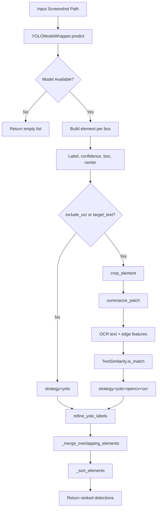

## 7) Execute-Test Self-Healing Sequence

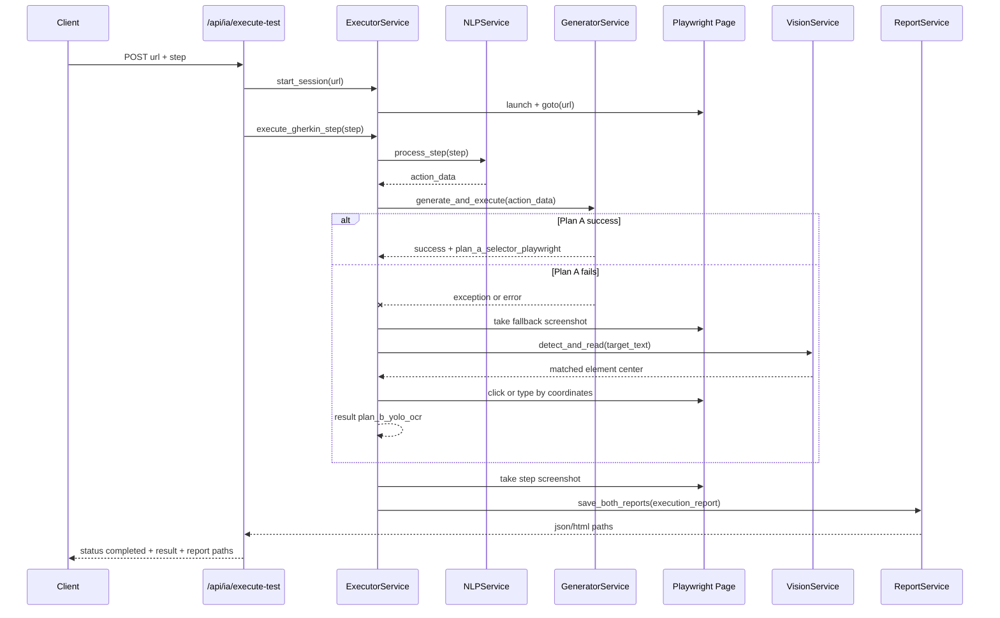

## 8) Step Execution State Machine

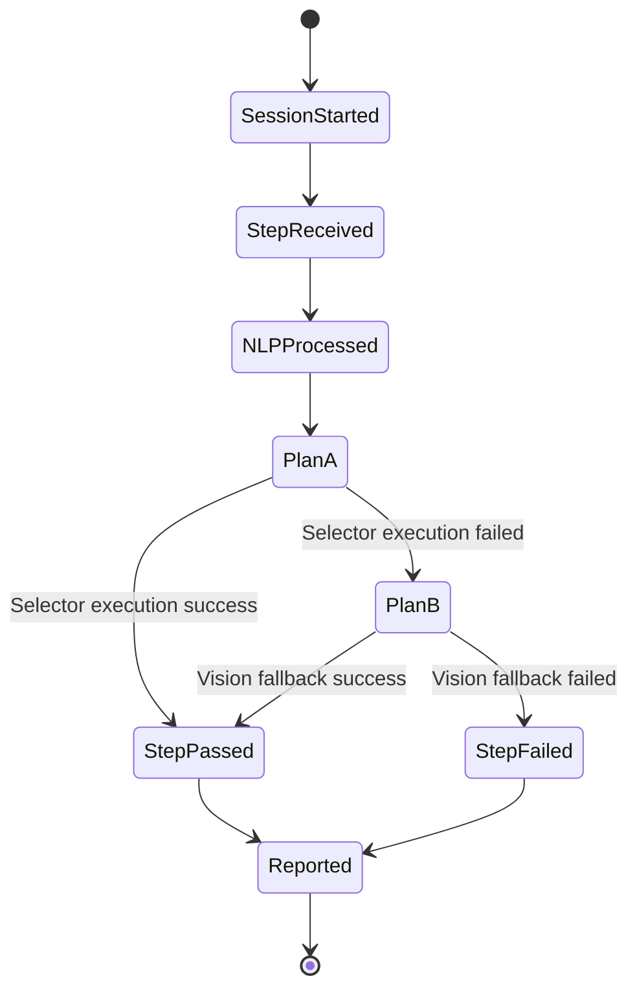

## 9) Reporting Lifecycle

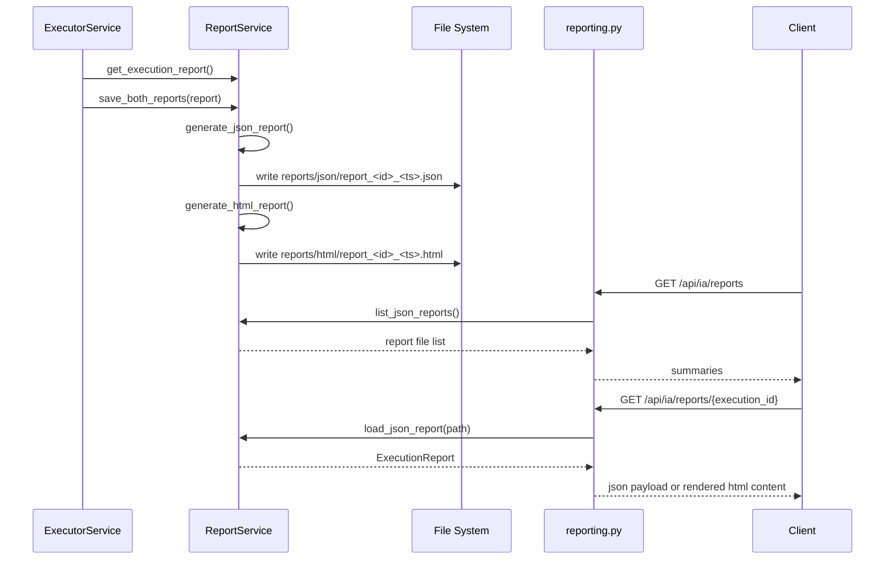

## 10) Core Data Model (Schemas)

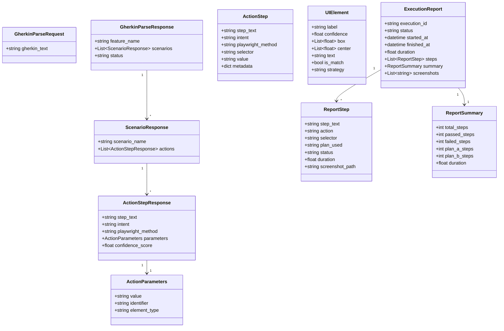

## 11) Deployment Diagram (Docker Compose)

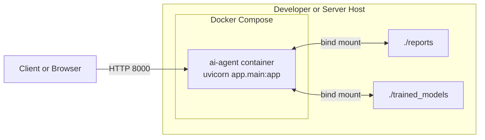

## 12) Tests and Benchmark Coverage

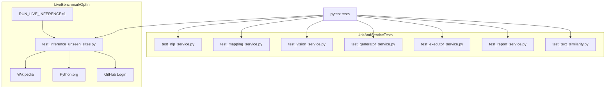

## 13) Inference Benchmark Sequence (Unseen Sites)

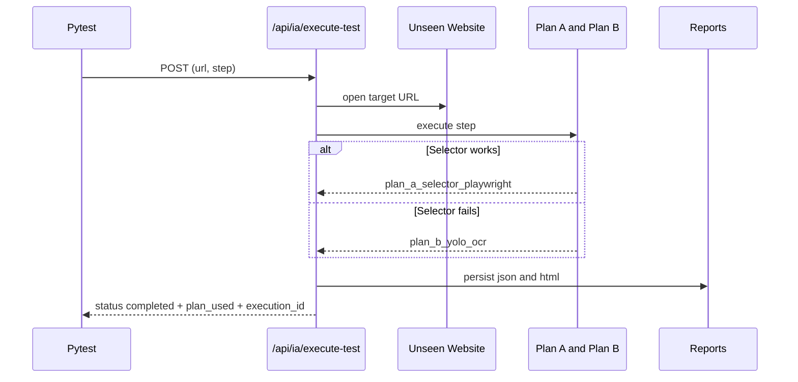

