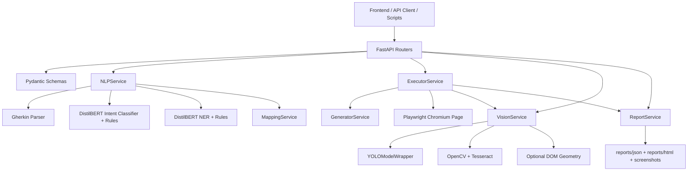
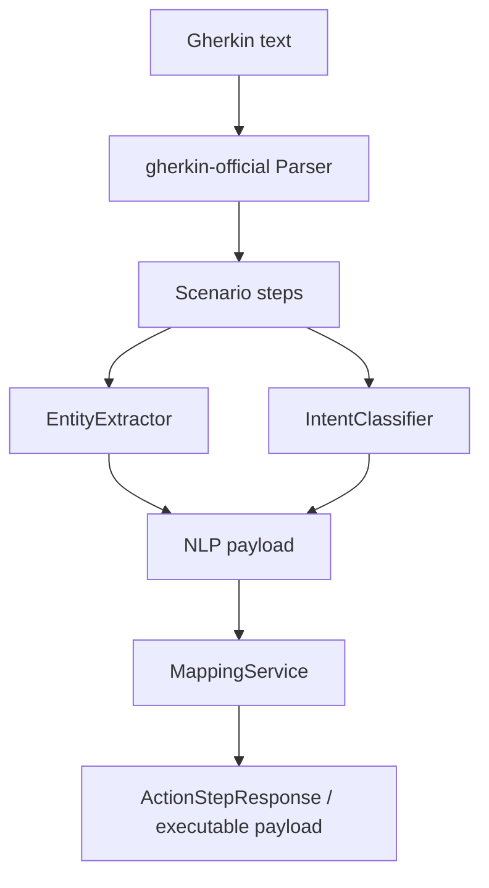
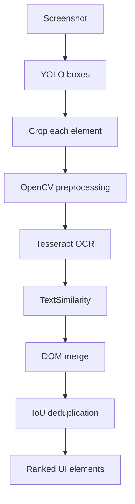
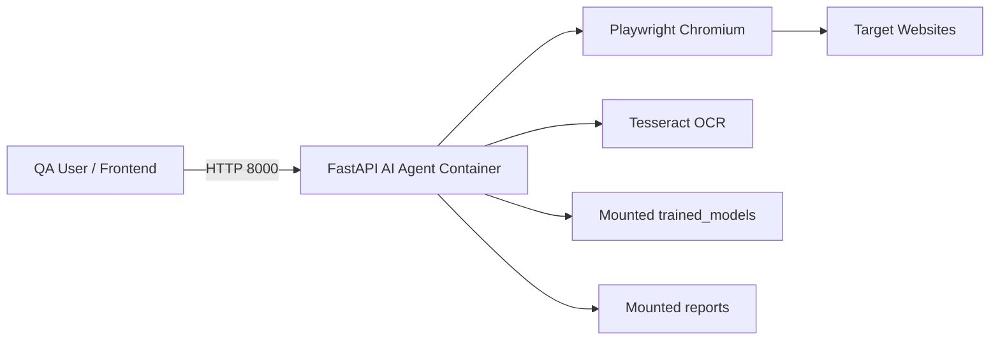
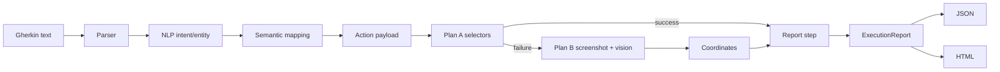
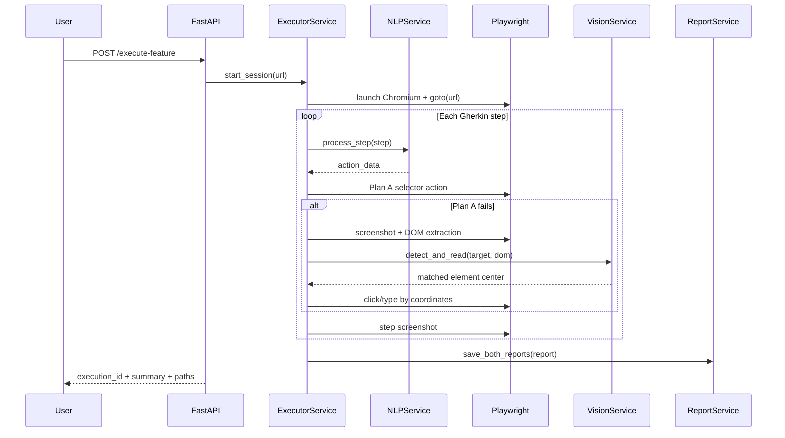

# PFE Technical Analysis - AI-Powered Functional Testing Agent

This document reconstructs the complete engineering understanding of the project from the current workspace. It is written as report-ready technical material that can be converted into LaTeX chapters, architecture diagrams, and defense slides.

## 1. Global Project Overview

The project is an intelligent functional testing agent that transforms BDD/Gherkin scenarios into executable browser automation. It combines natural language processing, semantic action mapping, Playwright automation, computer vision fallback, OCR, and report generation.

The main engineering idea is self-healing test execution:

- Plan A: execute actions through Playwright selectors derived from NLP and semantic rules.
- Plan B: when selectors fail, capture the browser screen, detect UI elements with YOLO, enrich detections with OCR and DOM geometry, then execute clicks or typing through screen coordinates.
- Evidence: persist execution traces as JSON, HTML, and screenshots.

The current implementation is a FastAPI backend with a lightweight frontend studio. Storage is file-system based (`reports/json`, `reports/html`, `reports/screenshots`, `trained_models`) rather than PostgreSQL/Redis. PostgreSQL and Redis are expected technologies in the original context, but they are not implemented in the scanned workspace.

## 2. Functional Objectives

- Parse `.feature`-style Gherkin text into feature, scenario, and step structures.
- Classify each natural-language step into actionable intents: navigation, click, type, verification, or unknown/manual check.
- Extract entities such as target UI element, value to input, and element type.
- Map NLP outputs to Playwright actions and selector candidates.
- Generate Playwright test code from parsed actions.
- Execute individual steps or complete features against real websites.
- Detect dynamic page issues such as cookie banners, dialogs, and selector changes.
- Use vision-based fallback when DOM selectors fail.
- Generate execution reports with pass/fail status, duration, screenshots, and Plan A/Plan B usage.
- Expose the system through REST APIs and a browser-based frontend studio.

## 3. Technical Objectives

- Decouple API, service, model, schema, and utility layers.
- Keep Pydantic schemas as explicit API contracts.
- Combine ML models with deterministic fallback rules to preserve robustness when checkpoints are unavailable or uncertain.
- Use Playwright for reliable browser automation and Chromium runtime control.
- Use YOLOv8 for UI element localization and Tesseract OCR for text extraction.
- Use OpenCV preprocessing for OCR and structural segmentation.
- Preserve traceability through structured logging and report artifacts.
- Provide repeatable execution through Docker and local scripts.

## 4. System Architecture

The architecture follows a layered service design:



Key modules:

- `app/main.py`: FastAPI app factory and router registration.
- `app/api/*`: HTTP endpoints.
- `app/services/*`: business logic.
- `nlp/*`: intent and entity model adapters.
- `app/models/*`: ML model wrappers.
- `app/utils/*`: parsing, image processing, text similarity, logging, screenshots.
- `app/schemas/*`: Pydantic request/response contracts.
- `frontend/*`: browser UI for running scenarios and viewing reports.

## 5. Detailed Workflow

End-to-end flow:

1. User submits Gherkin text and target URL through `/api/ia/execute-feature` or the frontend.
2. `test_execution.py` parses the feature with `parse_gherkin_text`.
3. `ExecutorService.start_session` launches Chromium, opens the URL, and registers dialog handling.
4. For each executable Gherkin step:
   - `NLPService.process_step` extracts intent and entities.
   - `MappingService.map_to_action` converts NLP into an `ActionStep`.
   - `GeneratorService.generate_and_execute` tries Playwright selectors.
   - If Plan A fails, `ExecutorService._execute_plan_b` captures a screenshot and runs vision fallback.
   - A screenshot is captured after the step.
   - A `ReportStep` is appended.
5. At the end, `ExecutorService.get_execution_report` builds an `ExecutionReport`.
6. `ReportService.save_both_reports` saves JSON and HTML files.
7. Reporting APIs expose report lists, summaries, and rendered HTML.

## 6. AI Pipeline

The AI pipeline is hybrid:

| Stage | Technique | Implementation | Purpose |
|---|---|---|---|
| Intent classification | DistilBERT sequence classification + regex fallback | `nlp/intent_classifier.py` | Convert step text into action class |
| Entity extraction | DistilBERT token classification + regex fallback | `nlp/entity_extractor.py` | Extract target and value |
| Semantic mapping | Rule-based selector synthesis | `app/services/mapping_service.py` | Convert abstract intent to executable action |
| UI detection | YOLOv8 | `app/models/yolo_model.py`, `app/services/vision_service.py` | Detect UI element bounding boxes |
| OCR | Tesseract with OpenCV preprocessing | `app/utils/image_processing.py` | Read detected UI text |
| Text matching | Normalized string similarity | `app/utils/text_similarity.py` | Match NLP target to visual text |
| Optional QA | HuggingFace QA pipeline | `app/models/qa_model.py` | Intended for screen-text verification, not central in execution |
| Optional embeddings | MiniLM embeddings | `app/models/embedding_loader.py` | Intended semantic similarity support |

Design choice: the system does not rely blindly on neural predictions. It uses deterministic rules before/after model inference, which is appropriate for testing systems where reliability and explainability matter more than model novelty.

## 7. NLP Pipeline

`NLPService` coordinates parsing and analysis:



`nlp/intent_classifier.py`:

- Loads `DistilBertTokenizer` and `DistilBertForSequenceClassification`.
- Uses label map:
  - `0 -> ACTION_CLICK`
  - `1 -> ACTION_TYPE`
  - `2 -> NAVIGATION`
  - `3 -> VERIFICATION`
- If checkpoint loading fails, falls back to keyword rules.
- If model confidence is below `0.5`, falls back to rules.

`nlp/entity_extractor.py`:

- Loads `DistilBertTokenizerFast` and `DistilBertForTokenClassification`.
- Uses BIO labels: `O`, `B-TARGET`, `I-TARGET`, `B-VALUE`, `I-VALUE`.
- Preferentially applies regex extraction when quoted literals exist.
- Handles patterns like:
  - `fill the "email" field with "demo@example.com"`
  - `type "OpenAI" into the search field`
  - `click the "login" button`
  - `Then I should see "Dashboard"`
- Infers element type (`button`, `input`, `header`, `element`) from target text and step intent.

Strength: strong practical coverage for common BDD phrasing.  
Weakness: limited multilingual and paraphrase coverage unless training data is expanded.

## 8. Computer Vision Pipeline

`VisionService` performs UI detection:

1. Load YOLO model from `trained_models/vision/yolov8_ui_elements2.pt`.
2. Run `YOLOModelWrapper.predict`.
3. For every bounding box:
   - Resolve class label.
   - Read confidence.
   - Compute `[x1, y1, x2, y2]` box and center point.
4. If OCR is requested:
   - Crop the detected element using OpenCV.
   - Preprocess with grayscale, Gaussian blur, and Otsu thresholding.
   - Run Tesseract with `--psm 6`.
   - Compute edge density with Canny.
5. Match OCR text against target text with `TextSimilarity`.
6. Refine labels using multilingual keyword dictionaries.
7. Merge detections with optional live DOM geometry.
8. Remove overlapping duplicate detections using IoU.
9. Sort by semantic match, confidence, and text length.



Strength: combines vision, OCR, and DOM evidence.  
Weakness: OCR accuracy is sensitive to font size, contrast, language, and screenshots.

## 9. Semantic Mapping Engine

`MappingService` translates NLP intent into executable methods:

| NLP intent | Playwright method | Meaning |
|---|---|---|
| `NAVIGATION` | `navigate` | Open URL |
| `ACTION_CLICK` | `click` | Click element |
| `ACTION_TYPE` | `input` | Fill input |
| `VERIFICATION` | `assert` | Check visible text |
| `UNKNOWN` | `manual_check` | Non-automated fallback |

Selector generation is rule-based:

- Buttons:
  - `button:has-text('label')`
  - `[role='button']:has-text('label')`
  - XPath button text search
  - `text='label'`
- Inputs:
  - `input[name='email']`, `input#email`
  - `input[name='pass']`, `input[type='password']`
  - placeholder/name/id contains selectors
  - label-following input XPath
- Links:
  - `a:has-text('label')`
  - XPath link text search

Special login selectors are prioritized because login buttons are common and often implemented with ARIA or submit buttons.

## 10. Playwright Test Generation Flow

`GeneratorService.generate_playwright_script` converts parsed actions into a JavaScript Playwright test:

- Emits `import { test, expect } from '@playwright/test';`.
- Adds one `test(...)` block.
- Avoids duplicate navigation URLs.
- Builds selectors using role-based locators for buttons and locator CSS for inputs.
- Generates:
  - `page.goto(url)`
  - `locator.click()`
  - `locator.fill(value)`
  - `expect(locator).toContainText(value)`
  - `selectOption(value)`

The generation endpoint `/api/ia/generate-test` returns both:

- Generated script text.
- Parsed action list for inspection.

## 11. Dynamic Adaptation Mechanism

Dynamic adaptation is implemented in `ExecutorService`:

- Dialog auto-handling: Playwright `dialog` events are accepted automatically.
- Popup dismissal: repeated attempts to click known close/accept/cookie selectors.
- Retry logic: `_execute_with_retry` attempts Plan A, then Plan B, then retries.
- Vision fallback:
  - Screenshot capture.
  - DOM extraction from visible elements.
  - YOLO/OCR detection.
  - semantic matching.
  - coordinate-based click/type/select/assert.
- Optional cookie step handling: if a cookie consent control is not visible, the step can be skipped successfully.

This is the main self-healing contribution of the project.

## 12. Reporting System

The reporting subsystem consists of:

- `ReportStep`: per-step trace.
- `ReportSummary`: aggregate counts.
- `ExecutionReport`: full execution object.
- `ReportService`: JSON/HTML generation and retrieval.
- `report.html.j2`: styled interactive report template.

Captured evidence:

- step text
- action
- selector
- plan used
- value
- status
- message
- duration
- screenshot path
- raw NLP payload and execution result metadata

Reports are stored under:

- `reports/json/report_<execution_id>_<timestamp>.json`
- `reports/html/report_<execution_id>_<timestamp>.html`
- `reports/screenshots/*.png`

## 13. Backend/API Architecture

FastAPI routers:

| File | Endpoint area | Role |
|---|---|---|
| `health.py` | `GET /health` | service health |
| `nlp_parsing.py` | `POST /api/ia/parse-gherkin` | Gherkin-to-actions parsing |
| `semantic_mapping.py` | `POST /api/ia/semantic-mapping` | NLP payload to Playwright action |
| `ql_detection.py` | `POST /api/ia/detect-ui`, `/analyze-screenshot` | screenshot UI detection |
| `segmentation.py` | `POST /api/ia/segment` | OpenCV structural segmentation |
| `test_generation.py` | `POST /api/ia/generate-test` | Playwright script generation |
| `test_execution.py` | `POST /api/ia/execute-test`, `/execute-feature` | browser execution |
| `reporting.py` | `GET /api/ia/reports...` | report listing and retrieval |

`app/main.py` configures CORS and sets `WindowsProactorEventLoopPolicy`, which is important because Playwright async execution on Windows can fail with the selector event loop policy.

## 14. Database & Storage Logic

The scanned implementation uses file storage:

- Model artifacts: `trained_models/nlp`, `trained_models/vision`
- Generated reports: `reports/json`, `reports/html`
- Screenshots: `reports/screenshots`
- Uploads: `data/uploads`
- Synthetic OCR images: `data/ui_screenshots`

No active PostgreSQL or Redis integration exists in the current codebase. For the report, this should be presented as a current limitation or future deployment evolution:

- PostgreSQL could store executions, steps, users, projects, and historical metrics.
- Redis could manage async task state, execution queues, caching, and real-time progress.

## 15. Docker & Deployment Logic

`Dockerfile`:

- Base image: `python:3.10-slim`.
- Installs system dependencies for OpenCV, Tesseract, and Playwright.
- Installs Python dependencies from `requirements.txt`.
- Downloads spaCy `en_core_web_sm`.
- Installs Playwright Chromium.
- Runs `uvicorn app.main:app --host 0.0.0.0 --port 8000`.

`docker-compose.yml`:

- Builds `ai-agent`.
- Publishes port `8000`.
- Loads `.env.example`.
- Bind-mounts:
  - `./reports:/app/reports`
  - `./trained_models:/app/trained_models`

Deployment architecture:



## 16. Folder-by-Folder Analysis

| Folder | Purpose |
|---|---|
| `app/api` | FastAPI route definitions and HTTP request orchestration |
| `app/services` | Core business services: NLP, vision, mapping, generation, execution, reports |
| `app/models` | Wrappers for YOLO, embeddings, and QA model |
| `app/schemas` | Pydantic models defining API and report contracts |
| `app/utils` | Gherkin parser, OpenCV/OCR utilities, logging, screenshots, text similarity |
| `app/templates` | Jinja/JS templates for Playwright and HTML reports |
| `nlp` | Custom NLP model adapters for intent and entity extraction |
| `scripts` | CLI utilities for training, execution, and model validation |
| `tests` | Unit, integration-style, API, and opt-in live inference tests |
| `tests/feature` | Gherkin sample scenarios for Google and Facebook |
| `notebooks` | Exploration/training notebooks, especially NLP and YOLO experiments |
| `trained_models` | Persisted model checkpoints for NLP and vision |
| `reports` | Generated reports, screenshots, and validation metrics |
| `frontend` | Bootstrap-based local web studio |
| `data` | Uploaded and synthetic image assets |
| `docs` | Diagrams and benchmark documentation |

## 17. File-by-File Important Analysis

| File | Technical role |
|---|---|
| `app/main.py` | Creates FastAPI app, configures CORS, registers routers, sets Windows event-loop policy |
| `app/config.py` | Environment-driven immutable settings dataclass with cached singleton |
| `app/services/nlp_service.py` | Orchestrates Gherkin parsing, intent classification, entity extraction, semantic mapping |
| `app/services/mapping_service.py` | Generates action methods and selector candidates from NLP output |
| `app/services/generator_service.py` | Generates Playwright code and executes individual actions through Playwright |
| `app/services/executor_service.py` | Runtime orchestrator for Playwright session, Plan A/Plan B, screenshots, reports |
| `app/services/vision_service.py` | YOLO/OCR/DOM UI detection and semantic ranking |
| `app/services/segmentation_service.py` | Traditional OpenCV contour segmentation for UI regions |
| `app/services/report_service.py` | Serializes, saves, loads, lists, and renders reports |
| `nlp/intent_classifier.py` | DistilBERT sequence classifier with rule fallback |
| `nlp/entity_extractor.py` | DistilBERT token classifier with regex fallback |
| `app/models/yolo_model.py` | Thin Ultralytics YOLO adapter |
| `app/models/embedding_loader.py` | MiniLM embedding loader and mean pooling |
| `app/models/qa_model.py` | Extractive QA wrapper over `deepset/roberta-base-squad2` |
| `app/utils/gherkin_parser.py` | Converts raw Gherkin into structured feature/scenario/steps |
| `app/utils/image_processing.py` | Crop, preprocess, OCR, edge-density extraction |
| `app/utils/text_similarity.py` | Accent stripping, multilingual normalization, token/ratio similarity |
| `app/utils/logging_config.py` | JSON structured logs |
| `app/templates/report.html.j2` | Human-readable HTML execution report |
| `frontend/script.js` | Calls parse/generate/execute/report/vision APIs from the UI |
| `scripts/run_pipeline.py` | CLI runner for feature files |
| `scripts/train_intention_classifier.py` | Minimal DistilBERT intent fine-tuning script |
| `scripts/train_entity_extractor.py` | Minimal DistilBERT token classification fine-tuning script |
| `evaluate_models.py` | Generates validation report with NLP/OCR and simulated YOLO/E2E metrics |

## 18. API Endpoints Explanation

Example parse request:

```json
POST /api/ia/parse-gherkin
{
  "gherkin_text": "Feature: Login\nScenario: Invalid login\nWhen I click the \"login\" button"
}
```

Example parse response:

```json
{
  "feature_name": "Login",
  "scenarios": [
    {
      "scenario_name": "Invalid login",
      "actions": [
        {
          "step_text": "When I click the \"login\" button",
          "intent": "ACTION_CLICK",
          "playwright_method": "click",
          "parameters": {
            "value": null,
            "identifier": "login button",
            "element_type": "button"
          }
        }
      ]
    }
  ],
  "status": "success"
}
```

Execution endpoints:

- `/api/ia/execute-test`: executes one step against one URL.
- `/api/ia/execute-feature`: executes the first scenario in a Gherkin feature and persists reports.

Vision endpoints:

- `/api/ia/detect-ui`: detects elements from an image path or URL.
- `/api/ia/analyze-screenshot`: accepts base64 upload and detects UI elements.
- `/api/ia/segment`: returns OpenCV structural regions.

Report endpoints:

- `/api/ia/reports`: list saved reports.
- `/api/ia/reports/{execution_id}`: retrieve summary or rendered HTML content.
- `/api/ia/reports/{execution_id}/summary`: retrieve compact metrics.

## 19. Data Flow Diagrams Description

Logical data flow:



Data entities:

- Input: URL, Gherkin text, screenshot image path/base64.
- Intermediate: parsed scenarios, action payloads, selector candidates, detected UI elements.
- Output: generated Playwright script, execution result, report files, screenshots.

## 20. Sequence Flow Explanation



## 21. Algorithms Used

- Gherkin AST parsing using `gherkin-official`.
- Transformer sequence classification for intent recognition.
- Transformer token classification with BIO tags for entity extraction.
- Regex-based information extraction as deterministic fallback.
- Selector candidate ranking by rule priority.
- YOLO object detection for UI element localization.
- OCR preprocessing:
  - grayscale conversion
  - Gaussian blur
  - Otsu thresholding
  - Tesseract OCR
- Canny edge detection for patch feature summary.
- IoU overlap removal for duplicate detections.
- SequenceMatcher and token overlap for semantic text matching.
- DOM-to-vision fusion by bounding-box IoU.
- Retry/self-healing execution state machine.

## 22. Machine Learning Models Used

| Model | Location | Use |
|---|---|---|
| DistilBERT sequence classifier | `trained_models/nlp/intention_classifier.pt` | Step intent classification |
| DistilBERT token classifier | `trained_models/nlp/entity_extractor.pt` | Target/value extraction |
| YOLOv8 UI detector | `trained_models/vision/yolov8_ui_elements*.pt` | UI element detection |
| MiniLM sentence transformer | loaded by `EmbeddingLoader` | Semantic embeddings, currently auxiliary |
| RoBERTa SQuAD2 QA | loaded by `QAModel` | Extractive QA, currently auxiliary |

## 23. Training Strategy

Implemented training scripts are minimal prototypes:

- `scripts/train_intention_classifier.py`
  - Creates a small labeled dataset for click/type/navigate/verify.
  - Tokenizes with DistilBERT.
  - Fine-tunes for one epoch.
  - Saves both HuggingFace directory and `.pt` state dict.
- `scripts/train_entity_extractor.py`
  - Builds BIO labels from a small raw dataset.
  - Aligns word-level tags to tokenized subwords.
  - Fine-tunes DistilBERT token classifier for one epoch.

For a PFE report, describe this as proof-of-concept fine-tuning. For stronger scientific validity, expand the dataset, split train/validation/test, and report macro-F1, confusion matrix, and entity-level F1.

## 24. Evaluation Metrics

`reports/validation_report.md` records:

- Intent accuracy: 100% on a small validation set.
- Intent F1: 100% approximated from accuracy.
- Entity precision: 100% on a small validation set.
- YOLO mAP@50: 88%, precision: 85%, recall: 82% (simulated or log-derived in `evaluate_models.py`).
- OCR recognition rate: 60%.
- End-to-end success rate: 90%.

Important caveat: some metrics are computed on tiny or synthetic samples, and YOLO/E2E metrics are placeholders/simulated in the evaluation script. This should be honestly framed as preliminary validation, not a full benchmark.

## 25. Error Handling Strategy

- API endpoints convert invalid inputs to `400`, missing files to `404`, and unexpected failures to `500`.
- NLP service returns `status="error"` for invalid Gherkin or empty text.
- Model loading catches exceptions and activates rule-based fallback.
- OCR catches Tesseract failures and returns empty text.
- Executor records failures as report steps with exception metadata.
- Browser cleanup is attempted in `finally` blocks.
- Optional cookie steps can be skipped when no consent control is visible.

## 26. Scalability Considerations

Current constraints:

- Each execution launches its own Chromium session.
- Reports are scanned from the filesystem.
- Model instances are singleton-like in some modules but heavyweight models can still slow startup.
- No execution queue or worker pool exists.

Potential improvements:

- Use Redis/Celery/RQ for async test jobs.
- Store executions and reports in PostgreSQL.
- Add report pagination and indexing.
- Reuse browser contexts safely through a session manager.
- Add model warmup and GPU-aware inference configuration.
- Separate API, worker, and model-serving components.

## 27. Security Considerations

Current risks:

- CORS allows all origins.
- Execution accepts arbitrary target URLs, creating SSRF-like and internal network risks.
- Browser automation can interact with third-party websites.
- Uploaded images are written to disk.
- Reports may store sensitive values such as emails/passwords in metadata and screenshots.
- No authentication/authorization exists in the backend.

Recommended controls:

- Restrict CORS.
- Add authentication and role-based authorization.
- Validate allowed domains for execution.
- Redact secrets in reports.
- Enforce upload size/type limits.
- Isolate browser execution in sandboxed containers.

## 28. Performance Optimization

Potential bottlenecks:

- Transformer model loading and inference.
- YOLO inference on large screenshots.
- Tesseract OCR per detected element.
- Playwright browser startup.
- File-system report scanning with many reports.

Optimizations:

- Cache loaded models.
- OCR only top-ranked candidate boxes.
- Resize screenshots before YOLO when acceptable.
- Batch OCR/detection where possible.
- Keep browser contexts warm for trusted workloads.
- Move old reports to indexed storage.

## 29. Testing Strategy

The project includes tests for:

- Pydantic schema validation.
- NLP service behavior.
- Mapping service.
- Generator service.
- Executor Plan A and Plan B behavior through mocks.
- Vision service.
- Image processing.
- Text similarity.
- Embedding loader.
- QA model.
- Screenshot utility.
- API endpoints.
- Report service.
- Opt-in live inference benchmark on Wikipedia, Python.org, and GitHub Login.

`docs/inference_benchmark_unseen_sites.md` defines the unseen-site benchmark. It is intentionally opt-in because real websites change and can make CI unstable.

## 30. DevOps Workflow

Local workflow:

```bash
python -m venv venv
venv\Scripts\activate
pip install -r requirements.txt
uvicorn app.main:app --reload
```

Test workflow:

```bash
venv\Scripts\python -m pytest tests -q
```

Docker workflow:

```bash
docker compose up --build
```

CLI workflow:

```bash
python scripts/run_pipeline.py tests/feature/demo_pfe.feature
```

## 31. Software Engineering Practices

Observed practices:

- Layered architecture.
- Service objects encapsulating domain logic.
- Pydantic DTOs for type-safe API contracts.
- Dependency separation between routers and services.
- Structured JSON logs.
- Template-based generation with Jinja2.
- Runtime fallback strategy for robustness.
- Unit tests with mocks for external dependencies.
- Dockerized deployment environment.

Technical debt:

- Some generated/demo files contain encoding artifacts.
- Some scripts are outdated relative to async `ExecutorService`.
- PostgreSQL/Redis are expected but absent.
- `playwright_headless` setting exists but `ExecutorService` launches `headless=False`.
- Heavy model imports can make tests/startup slower.

## 32. Challenges Solved

- Bridging natural-language BDD steps with deterministic browser automation.
- Handling selector brittleness through self-healing vision fallback.
- Reconciling DOM-level automation with visual UI perception.
- Capturing evidence for test traceability.
- Making AI behavior explainable through selector candidates, metadata, and reports.
- Managing dynamic website obstacles such as dialogs and cookie banners.

## 33. Limitations

- Training datasets are very small in the committed scripts.
- Some evaluation metrics are synthetic or simulated.
- No persistent database layer.
- No job queue or real-time execution status.
- No backend authentication.
- OCR is fragile on complex visual designs.
- YOLO model quality depends on unseen training data not fully documented in code.
- Only the first scenario is executed in `/execute-feature`.
- Background steps are parsed by Gherkin but not specially integrated beyond the execution flow.
- Frontend is local and simple; it is not a full multi-user dashboard.

## 34. Future Improvements

- Add PostgreSQL for executions, reports, users, and projects.
- Add Redis queue for long-running browser jobs.
- Add WebSocket/SSE progress updates.
- Execute all scenarios and backgrounds correctly.
- Expand multilingual NLP training data.
- Add confidence scores to parsed outputs.
- Integrate embedding similarity into mapping.
- Improve OCR using EasyOCR/PaddleOCR or vision-language models.
- Add advanced popup/modal detection.
- Add secret redaction in screenshots and report metadata.
- Add CI pipeline with unit tests, Docker build, and smoke tests.
- Add report export to PDF.
- Add trend dashboards and historical analytics.

## 35. Innovation Aspects

The innovation is the combination of:

- BDD/Gherkin as high-level test specification.
- NLP for intent and entity interpretation.
- Rule-based semantic mapping for explainability.
- Playwright for deterministic automation.
- YOLO/OCR fallback for self-healing UI interaction.
- DOM and vision fusion for more reliable element localization.
- Evidence-oriented reporting for QA traceability.

This hybrid architecture is stronger than a pure ML system because it preserves deterministic behavior while using AI only where flexibility is needed.

## 36. PFE Contribution & Research Value

The project contributes an applied intelligent QA automation architecture. It addresses the practical problem of brittle functional tests by adding semantic understanding and visual adaptation.

Research value:

- Demonstrates how NLP can transform BDD language into executable actions.
- Evaluates a hybrid symbolic/neural architecture for UI automation.
- Shows how visual perception can repair failed DOM selector execution.
- Provides an end-to-end traceable pipeline from specification to execution evidence.
- Opens future work in robust UI understanding, multimodal test agents, and self-healing QA systems.

## Appendix A - Runtime Pseudocode

```python
def execute_feature(url, gherkin_text):
    parsed = parse_gherkin_text(gherkin_text)
    executor.start_session(url)

    for step in parsed.first_scenario.steps:
        if is_navigation_given(step):
            continue

        action = nlp.process_step(step.text)

        try:
            result = execute_with_playwright_selectors(action)
            plan = "Plan A"
        except Exception:
            screenshot = capture_screenshot()
            dom = extract_visible_dom_nodes()
            detections = vision.detect_and_read(screenshot, action.target, dom)
            matched = best_semantic_match(detections, action.target)
            result = execute_by_coordinates(matched.center, action)
            plan = "Plan B"

        screenshot = capture_step_screenshot()
        report.add_step(step, action, result, plan, screenshot)

    report_service.save_json(report)
    report_service.save_html(report)
```

## Appendix B - Suggested LaTeX Chapter Mapping

| LaTeX chapter | Source sections |
|---|---|
| General Introduction | 1, 2, 3, 36 |
| State of the Art | 6, 7, 8, 22, 35 |
| Requirements and Analysis | 2, 3, 32, 33 |
| Architecture and Design | 4, 5, 13, 14, 15, 19, 20 |
| Implementation | 7-12, 16-18, 21 |
| Validation and Evaluation | 23, 24, 29 |
| Deployment and DevOps | 15, 26, 28, 30 |
| Security and Limits | 25, 27, 33 |
| Conclusion and Perspectives | 34, 35, 36 |

